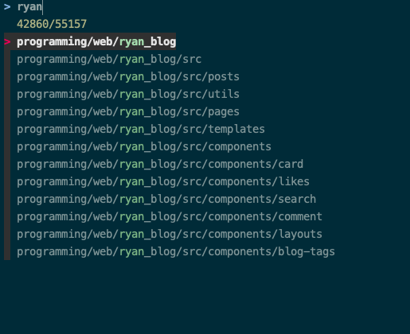
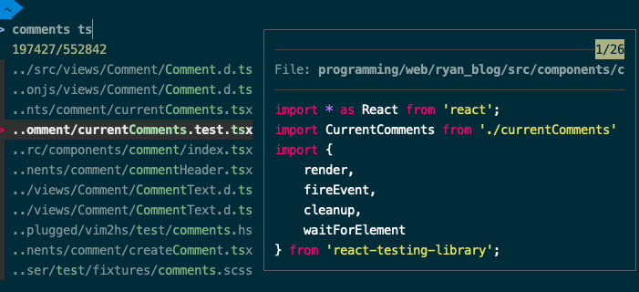
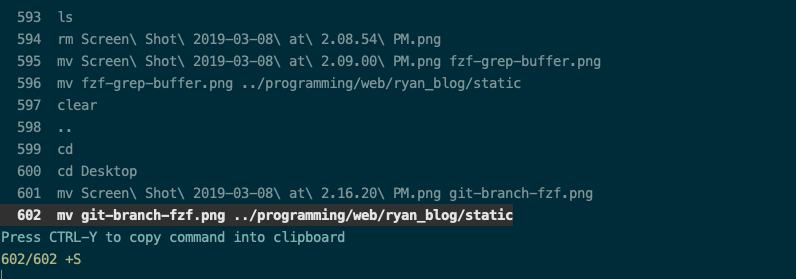
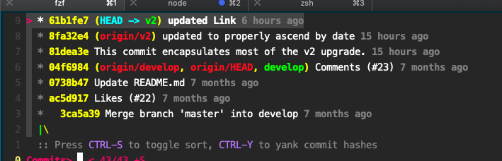
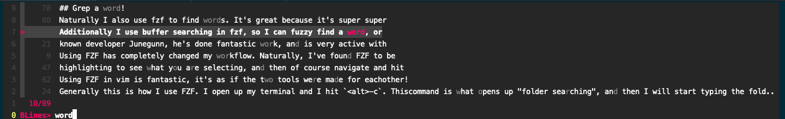
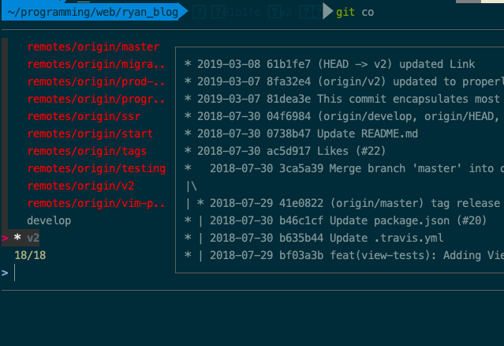

Using FZF has completely changed my work flow. Naturally, I've found FZF to be a great tool for vim, but even if you are not a vim user you may find a ton of uses for it.

### What is FZF
FZF is a terminally fuzzy finder. If you've used Sublime Text or vscode, then you are probably aware of what this is. FZF allows you to fuzzy find files, folders, and even recent terminal commands by default. You can also utilize it to pipe information from a terminal into FZF, and then fuzzy find from there.

### FZF In The Terminal
First things first, [FZF](https://github.com/junegunn/fzf/) is written by a well known developer Junegunn, he's done fantastic work, and is very active with support for all his plugins. Thanks!

Generally this is how I use FZF. I open up my terminal and I hit `<alt>-c`. This command is what opens up "folder searching", and then I will start typing the folder I would like to navigate to, like "ryans_blog".  A window like this will appear: 

Hitting enter will immediately navigate me into the folder. Great!

If I want to navigate through the options, I use `<ctrl-j>` and `<ctrl-k>` (vim style bindings), or you can use arrow keys!

Now that I am in the folder I normally operate with `vim .` and begin coding, but let's say we are in a rebase, and we want to open just one file. Like `comments.tsx`. Do I need to open `vim .`, then open my fuzzy finder, or navigate through my file explorer to that file? No!

That's where `<ctrl-t>` comes in!

`<ctrl-t>` is FZF's file searching functionality! Let's take a look:

This is nice, because you can easily setup a preview window, with syntax highlighting to see what you are selecting, and then of course navigate and hit enter!

Normally I prefix the command like:  `vim` then hit <ctrl-t> and hit enter, which will populate the terminal with the file path, and then enter again will run the command. If you want to select multiple files, use `tab`.

There are a ton of ways to fuzzy find with FZF, so I encourage more research in the documentation. It's excellent.

What about running terminal commands? Do you hate typing the same thing over and
over, especially if it's a long one? That's where `<C-r>` comes in.

This will open up your recent commands (really its a huge history of them all)
and naturally you can fuzzy find your way through them.
 
 Here's a looksy:
 

### Using FZF in vim

Using FZF in vim is fantastic, it's as if the two tools were made for each other! Just like in the terminal, you can use FZF as your fuzzy finder, but like I mentioned earlier you can pipe anything into FZF, so what else do I use it
for?

## Commits

I love that FZF can pipe git commits, and navigate through what was previously there. It looks like this:

Hitting enter will open up the git commit information, allowing you to navigate the information at that commit, and the entire structure of your project. It's pretty nifty!

## Grep a word!

Naturally I also use FZF to find words. It's great because it's super super
fast!

For me, `<Leader>-s` is how I grep, and it will find through the entire repo.

Additionally I use buffer searching in FZF, so I can fuzzy find a word, or a phrase or anything in my literal buffer like so:

Again, Enter will navigate me to the line and word I want. 

## FZF <3 Git.

FZF loves git. Again I use fzf for so many git things, but in short, I have setup a few functions from the documentation.

Since you are getting the overall idea:

Sometimes I need to checkout a remote branch. I type `git checkout -b` and then hit `<c-g><c-b>`. Think "git branch" so that will open up FZF piping all the git branches that exist on the repository including
remotes. 

Sometimes I want to add just a few files,

`<c-g><c-f>` for "git files" will speed me through all the files that are in my staging area, and I am able to use tab to select multiple, and then enter away to add them to the terminal line.

## Possibilities are Endless!

As you can see this, is just some of the power that I use FZF for, it's a fantastic tool, and everyone I have showed it that took the time to learn it, has absolutely loved it.

The documentation is fantastic, (use `fd` for faster searching!) and it's a breeze to setup.

You can pipe a dictionary into FZF and fuzzy find the words, you can pipe terminal commands like brew and fuzzy find brew installations, it's literally endless!

This is just a brief overview of how I use FZF, and I really hope I've sparked some interest in you checking it out.
